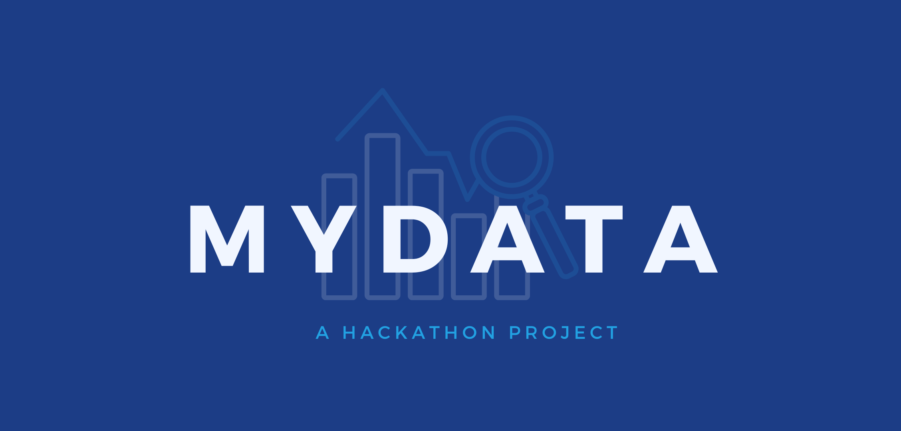

# My Data

Description: My Data is an Electron/React application intended to allow users to view their data usage on their computer. My Data gives user the best usability when viewing their data, without unecessary information. This project was developed for the 2023 Inatel's Hackathon.

## Installation
### Pre-requisites: 
- Python3
- Npcap (or Libpcap)

To install and run the My Data application locally, follow these steps:

1. Clone the repository:

        git clone https://github.com/juliocjuri/my-data.git

2. Navigate to the project directory:

        cd my-data

3. Install the node dependencies inside main application and backend

       npm install
       cd backend
       npm install

4. Install python dependencies:
        
        cd ../src/connection
        pip install -r requirements.txt

## Usage

To start the My Data application on Windows, use the following command:
    
    npm run start:windows

This will automatically build the React application and start the Electron run script.

If you want to simulate only the react application, without electron, simply run 'npm run dev'. This will automatically start the application as a simple vite project.

## Easier Development

In order to develop this project more efficiently, you can launch the main three applications separately.

1. Navigate to the root folder and execute

        npm run dev

2. Go inside src/connection and:

        pm2 start traffic_analyzer.py

3. Go to the backend folder and start the api

        pm2 start index.js

        or

        nodemon index.js

